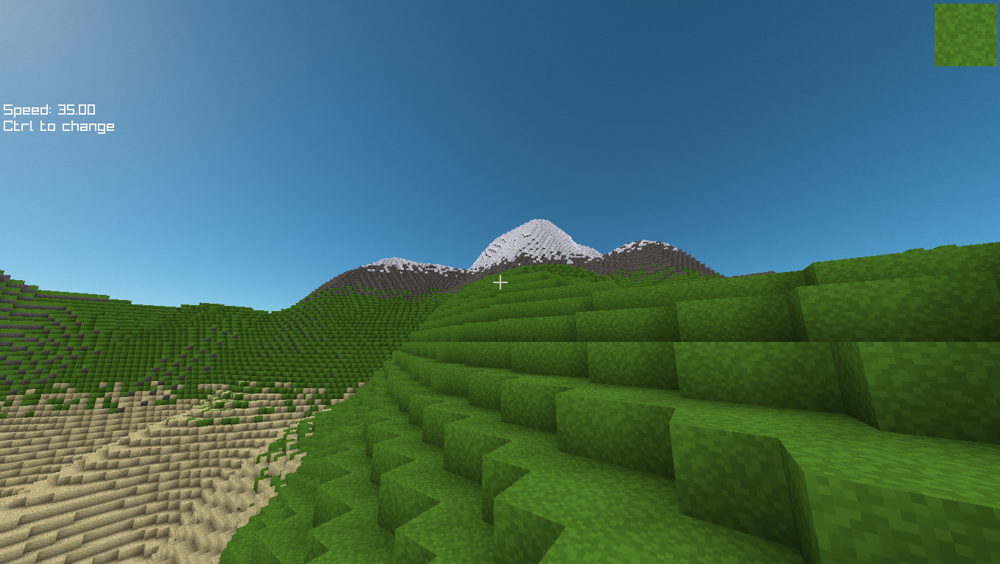
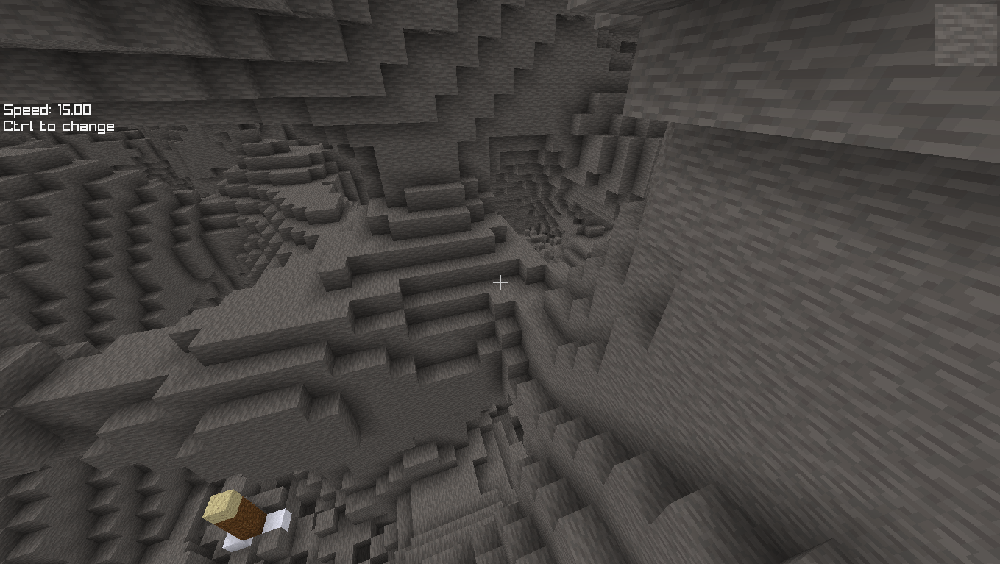

# Mine

A Minecraft clone without crafting. 

### Getting started
just download [release.zip](https://github.com/BrownNPC/Mine/releases/latest)

It contains binaries for `windows` AND `linux`

#### Controls
> You can press F6 to generate a new world, and F3 in-game to view the controls.

`ESC`: toggle mouse lock

`F6`: regenerate world

`F3`: show debug menu & controls

`Scroll`: change held block

`Shift`: descend

`Space`: ascend

`Left Mouse`: break

`Right Mouse`: place

#### Some optimization techniques used:
- Rendering geometry only for air-exposed block faces.
- Frustum culling to skip chunks that are not infront of the camera.
- Using efficient data structures to represent chunks (arrays of bytes, flat array backing 3d array)
- Force garbage collector every second to keep memory usage stable (does not impact performance)
- Storing chunk vertices efficiently on the gpu (5 bytes per vertex)
- Prebaked smooth lighting (ambient occlusion)

#### Optimizations for the future
- [Occlusion culling to skip chunks which are hidden by other chunks](https://tomcc.github.io/2014/08/31/visibility-1.html)
